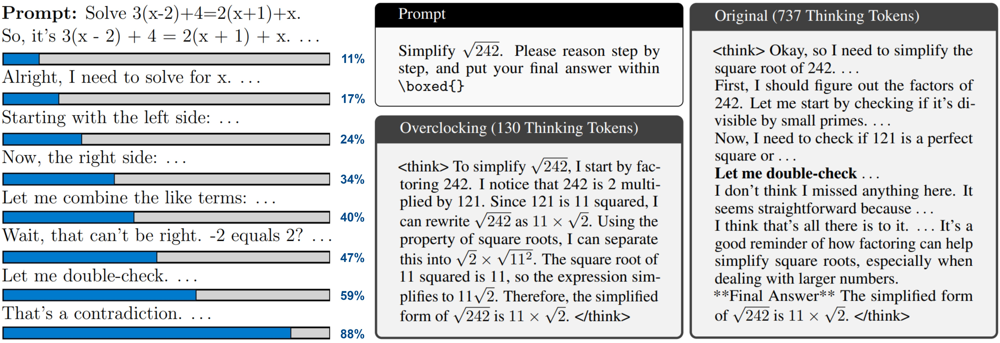
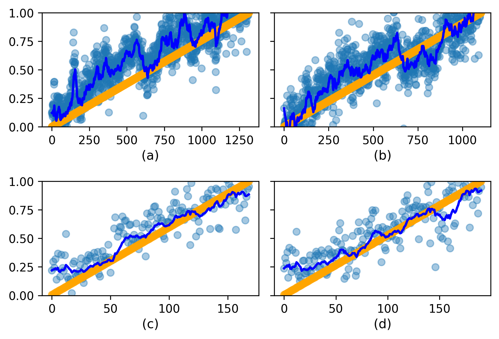
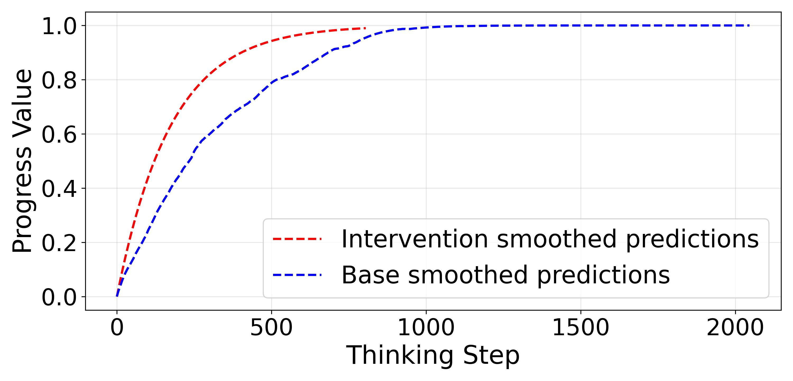

# Thinking Progress Vectors (TPV) 


*Our Thinking Progress Vectors enable real-time monitoring of language model thinking progress as well as acceleration of thinking for more effective and efficient reasoning*

## Links

> **📖 Paper**: [Overclocking LLM Reasoning: Monitoring and Controlling Thinking Path Lengths in LLMs](https://arxiv.org/abs/2506.07240)

> **🌐 For more details and interactive examples visit our [**Project Page**](https://royeisen.github.io/OverclockingLLMReasoning-paper/)**

---

This repository contains scripts for training and utilizing a Thinking Progress Vectors (TPV) system. This system consists of two main parts:

1. **TPV Monitoring Pipeline**: A three-step process to generate data, prepare datasets, and train a TPV regressor model.
2. **TPV Intervention System**: A system that uses the trained TPV regressor to intervene in the generation process of language models.


## Part 1: TPV Monitoring Pipeline


*TPV regressor models enable robust progress monitoring across different problem-solving approaches.*

The monitoring pipeline consists of three sequential scripts that should be run in the following order:

### Step 1: Generate TPV Data

This script generates responses from a language model and extracts hidden states for TPV training.

```bash
python generate_tpv_data.py \
  --model "deepseek-ai/DeepSeek-R1-Distill-Qwen-32B" \
  --max_new_tokens 1024 \
  --dataset "math500" \
  --start_problem_index 0 \
  --end_problem_index 30 \
  --generations_per_problem 5 \
  --output_dir "hidden_states_output" \
  --temperature 0.6 \
  --do_sample True \
  --top_p 0.95 \
  --seed 42
```

This will generate model responses and extract hidden states, storing the results in the `hidden_states_output` directory.

### Step 2: Prepare TPV Dataset

This script processes the generated hidden states and creates training/testing datasets for the TPV regressor.

```bash
python prepare_tpv_dataset.py \
  --input_dir "hidden_states_output" \
  --output_dir "qwen_math_tpv_dataset" \
  --seed 42 \
  --train_split_ratio 0.8 \
  --end_of_thinking_token "</think>"
```

This will process the hidden states from the previous step and create train/test datasets in the `qwen_math_tpv_dataset` directory.

### Step 3: Train TPV Regressor

This script trains a linear regression model on the prepared datasets to predict token progress values.

```bash
python train_tpv.py \
  --input_dir "qwen_math_tpv_dataset" \
  --output_dir "qwen_math_tpv_model" \
  --epsilon 1e-10 \
  --device "cuda"
```

This will train a TPV regressor using linear regression, evaluate its performance, and save the model weights to the `qwen_math_tpv_model` directory.

## Part 2: TPV Intervention System


*Comparison of base model (blue) vs intervened model (red) prediction trajectories. The intervention system steers the model toward more efficient and focused reasoning paths.*

After training the TPV regressor, you can use it to intervene in the generation process of language models.

### Running TPV Intervention

This script uses the trained TPV regressor to modify the hidden states during the language model generation process.

```bash
python tpv_intervention.py \
  --model_name_or_path "deepseek-ai/DeepSeek-R1-Distill-Qwen-32B" \
  --intervention_vector_path "qwen_math_tpv_model/tpv_linear_weights.npy" \
  --dataset "math500" \
  --output_generations_dir "qwen_intervention_responses" \
  --task_name "math500" \
  --problem_start_idx 30 \
  --problem_end_idx 35 \
  --alpha 100.0 \
  --max_new_tokens 2048 \
  --device "cuda" \
  --torch_dtype "float16"
```

This will apply the trained intervention vector to the model's generation process with the specified alpha scale factor, and save the results in the `llama_intervention_responses` directory.

## Example End-to-End Pipeline

Here's an example of running the complete pipeline with consistent input/output directories:

```bash
# Step 1: Generate hidden states data
python generate_tpv_data.py --model "deepseek-ai/DeepSeek-R1-Distill-Llama-8B" --output_dir "llama_hidden_states"

# Step 2: Prepare the TPV dataset
python prepare_tpv_dataset.py --input_dir "llama_hidden_states" --output_dir "llama_math_tpv_dataset"

# Step 3: Train the TPV regressor
python train_tpv.py --input_dir "llama_math_tpv_dataset" --output_dir "tpv_model"

# Step 4: Use the trained TPV regressor for intervention
python tpv_intervention.py --model_name_or_path "deepseek-ai/DeepSeek-R1-Distill-Llama-8B" --intervention_vector_path "tpv_model/tpv_linear_weights.npy" --alpha 100.0
```

## Notes
- Ensure that the model names and data paths are correctly set according to your environment.
- The alpha parameter controls the strength of the intervention - higher values result in stronger interventions.
- alpha can be set to 0.0 to disable the intervention.

## Citation
If you find this work useful, please consider citing our paper:

```bibtex
@misc{eisenstadt2025overclockingllmreasoningmonitoring,
      title={Overclocking LLM Reasoning: Monitoring and Controlling Thinking Path Lengths in LLMs}, 
      author={Roy Eisenstadt and Itamar Zimerman and Lior Wolf},
      year={2025},
      eprint={2506.07240},
      archivePrefix={arXiv},
      primaryClass={cs.LG},
      url={https://arxiv.org/abs/2506.07240}, 
}
```

## License
This repository is licensed under the [CC BY-NC-SA 4.0](https://creativecommons.org/licenses/by-nc-sa/4.0/) license and provided for non-commercial use only. For commercial use, you must obtain a commercial license by contacting Ramot(yair.eran@ramot.org).
